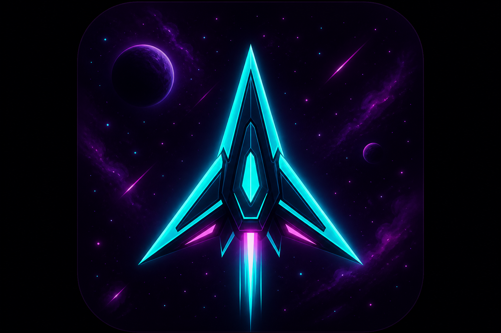
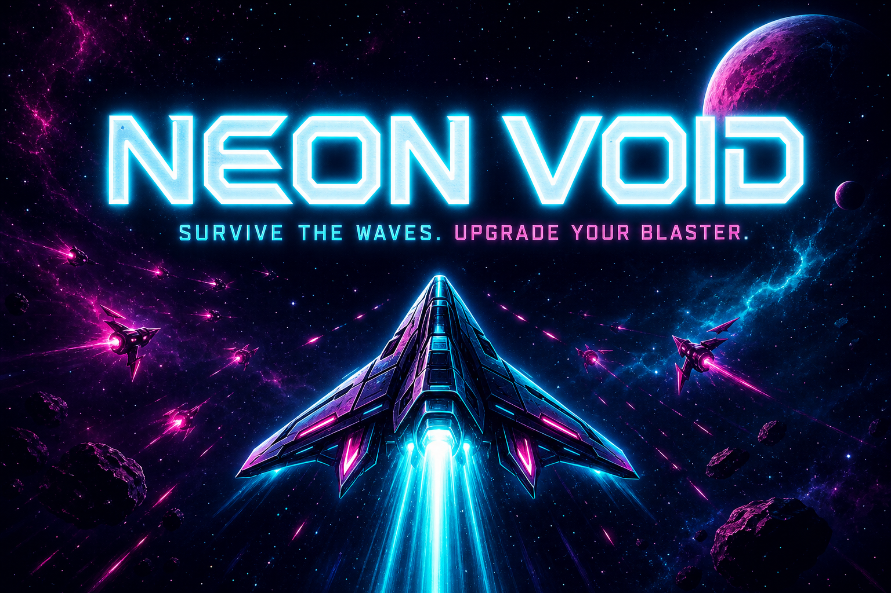

<p align="center">
  
</p>

<h1 align="center">NEON VOID</h1>

<p align="center">
  <strong>Drift. Survive. Upgrade. Break the combo ceiling.</strong><br />
  <a href="https://mayphex.com"><strong>▶ Play now at mayphex.com</strong></a>
</p>

<p align="center">
  
</p>

---

You are alone in the void — a single ship against an endless neon tide. Enemies spiral in from every angle. Your hull cracks. Your combo climbs. Credits pile up. Between waves, the **Void Shop** opens and you decide what kind of pilot you become next.

Built as a fast canvas arcade game **and** a living testbed for reinforcement learning. Today you can play it in the browser. Tomorrow, trained agents will fight beside you in **AI Mode** — and the long game is a native **iOS** release.

---

## The loop

Every run follows the same addictive rhythm. Master it, or die trying.

```
LAUNCH → FIGHT THE WAVE → EARN CREDITS → VOID SHOP → NEXT WAVE → …
                ↑                                              |
                └──────────── boss waves · bigger stakes ──────┘
```

### 1. Launch into the void

Drop into a procedural starfield — drifting planets, shooting stars, particle chaos. You start with the **Pulse Bolt** blaster and 100 hull integrity. Movement is momentum-based: you drift, you don't stop on a dime. Positioning is everything.

### 2. Clear the wave

Enemies escalate from lazy **Drifters** to aggressive **Hunters**, orbiting **Orbiters**, splitting **Splitters**, and screen-filling **Bosses**. Chain kills to build **combo multipliers**. Grab powerups mid-fight — rapid fire, spread, pierce, damage boost, heal, mega.

The wave banner flashes. The HUD counts down. The void does not care.

### 3. Spend credits in the Void Shop

Between waves, spend hard-earned **CR** on three tabs:

| Tab | What you buy |
|-----|----------------|
| **Blasters** | Pulse Bolt → Needle Stream → Shard Burst → Pierce Lance → Twin Stream → Nova Cannon |
| **Support** | Hull repair, reinforced hull (+max HP) |
| **Skins** | Interceptor, Needle, Bulwark, Phantom, Comet |

Your loadout persists. Each run is a build path, not a reset.

### 4. Push deeper

Waves scale. Enemies get meaner. Your blaster choice matters. Your positioning matters more. How far can you push before the void wins?

---

## Fight your way

| | Desktop | Mobile |
|---|---------|--------|
| **Move** | `W` `A` `S` `D` | Left thumb joystick |
| **Aim & fire** | Mouse / `Space` | Right thumb aim & fire |
| **Pause** | `Esc` / `P` | `Esc` / `P` |

Touch controls are tuned for phones — aim smoothing, dual-thumb layout, reduced screen shake. Play in the browser today; native touch is the foundation for what's next on iOS.

---

## AI Mode — today and tomorrow

<p align="center">
  
</p>

**AI Mode** is already in the game. Hit it from the main menu and watch a **rule-based bot** pilot your ship — dodging hostile fire, strafing enemies, recentering when pushed to the edges, and auto-respawning after death.

That's the baseline. The real vision is bigger.

### The ML roadmap

Neon Void is being built out as an **ML project** with a full **training suite**:

- **Headless simulation** — `GameSim` runs without rendering for fast rollouts (`headless: true`)
- **Fixed observation space** — `observe(sim)` returns a normalized `Float32Array` of player state, nearest enemies, incoming bullets, and powerups
- **Discrete action space** — 18 actions (9 movement directions × fire on/off) via `agentActionToInput()`
- **Deterministic seeds** — `Prng` for reproducible training runs and fair model comparison
- **Zero-GC hot path** — reusable buffers so training loops can crank at 60+ steps/sec

The training loop is designed to be simple:

```ts
const sim = new GameSim({ headless: true });
sim.resize(800, 600);
sim.start();

while (sim.phase === "playing") {
  const obs = observe(sim);           // state vector
  const action = agent.act(obs);      // your model
  sim.update(1 / 60, agentActionToInput(action, sim));
}
```

**What's coming:**

- A proper **training suite** — rollout collectors, reward shaping, checkpointing, evaluation harnesses
- **Model shootouts in AI Mode** — load different policies (heuristic, RL, evolutionary, neural) and pit them against the same seeded waves
- **Leaderboards per model** — wave reached, score, survival time, credits earned
- **Human vs agent** — same arena, same rules, who clears wave 10 first?

The game is the environment. AI Mode is the arena. The shop meta-layer means agents can't just memorize one wave — they have to survive *and* economize.

---

## Road to iOS

The browser build is step one. The goal is a **native iOS release** — same core sim, same feel, App Store distribution.

Why the architecture already points there:

- **Canvas game loop** isolated from React UI — portable to any renderer
- **Mobile touch controls** already shipped and tuned in production
- **Headless `GameSim`** — training on desktop/server, deploying weights to device
- **Small dependency footprint** — React shell today; native shell tomorrow without rewriting combat

iOS means offline play, Game Center scores, and agents running on-device. The neon void goes in your pocket.

---

## Stack

| Layer | Tech |
|-------|------|
| UI shell | React 18, TypeScript |
| Game engine | Canvas 2D — `GameSim`, `GameRenderer`, pooled entities |
| Build | Vite 7 |
| Persistence | `localStorage` (scores, blasters, skins) |
| Agents | `RuleBot` (now) → trained models (next) |

No Unity. No Phaser. Just a tight sim with a clean boundary between **play** and **train**.

---

## Run it locally

**Node.js 22+** (matches CI)

```sh
cd game
npm install
npm run dev      # http://localhost:3000
npm run build    # → game/dist
```

Module map for contributors: [`src/game/README.md`](./src/game/README.md)

---

## Deploy

Pushes to `master` build `game/` and publish to GitHub Pages at **[mayphex.com](https://mayphex.com)** via [`.github/workflows/deploy.yml`](../.github/workflows/deploy.yml).

---

<p align="center">
  <strong>Neon Void</strong> — part of the <a href="../">CATALYX Widgets</a> monorepo.<br />
  Same game core powers the Palantir Foundry OSDK widget in <code>foundry-widget/</code>.
</p>

<p align="center">
  <sub>Survive the waves. Train the agents. Ship it to iOS.</sub>
</p>
